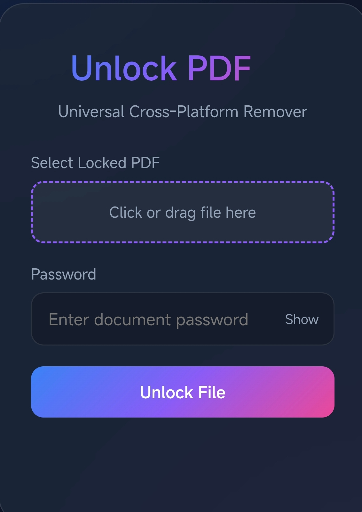

# PDF Password Remover

Unlock Secured PDF Files Instantly | Free & Open Source

## Overview

PDF Password Remover is a free, open-source web application that allows you to unlock password-protected PDF files directly in your browser. Remove restrictions and recover access to your important documents with a simple, privacy-friendly tool—no uploads, no server processing, 100% client-side.

---

## Features

- **Unlock PDF Passwords:** Remove owner/user passwords from PDF files instantly.
- **Advanced Recovery:** Handles both standard and advanced encryption with a fallback visual recovery mode.
- **Cross-Platform:** Works on any device (Windows, Mac, Linux, Android, iOS) via your web browser.
- **Privacy First:** All processing is done locally in your browser. Your files never leave your device.
- **Modern UI:** Clean, mobile-friendly interface with drag-and-drop support.
- **No Installation Needed:** 100% web-based, no software download required.

---

## How It Works

1. **Select your locked PDF file.**
2. **Enter the password** (if required).
3. **Click "Unlock File"** and wait for the process to complete.
4. **Download your unlocked PDF** instantly.

The app first attempts standard decryption. If advanced encryption is detected, it uses a visual recovery method to rebuild the PDF page by page.

---

## Usage

1. Open [index.html](index.html) in your browser.
2. Follow the on-screen instructions to unlock your PDF.

---

## Technologies Used

- [pdf-lib](https://pdf-lib.js.org/)
- [pdf.js](https://mozilla.github.io/pdf.js/)
- [jsPDF](https://github.com/parallax/jsPDF)
- HTML5, CSS3, JavaScript (Vanilla)

---

## SEO Keywords

PDF password remover, unlock PDF, remove PDF password, free PDF unlocker, open source PDF unlock, browser PDF unlock tool, privacy PDF unlock, client-side PDF unlock, no upload PDF unlock, cross-platform PDF unlock, instant PDF unlock, secure PDF unlock, PDF decryption tool

---

## License

This project is licensed under the [MIT License](LICENSE).

---

## Author

Created by [MaheshTechnicals](https://github.com/MaheshTechnicals)

---

## Contributing

Pull requests are welcome! For major changes, please open an issue first to discuss what you would like to change.

---

## Disclaimer

This tool is intended for legal use only. Do not use it to unlock PDF files without permission from the document owner.